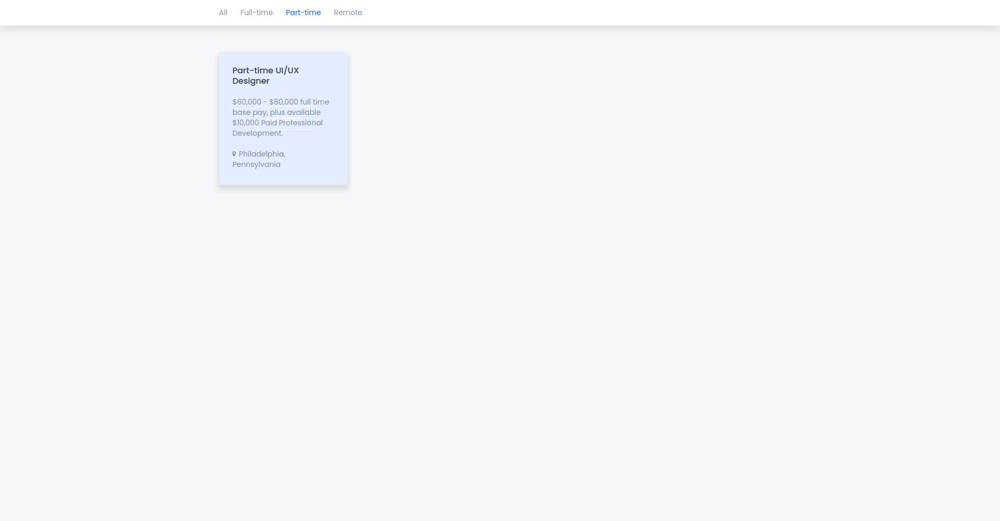
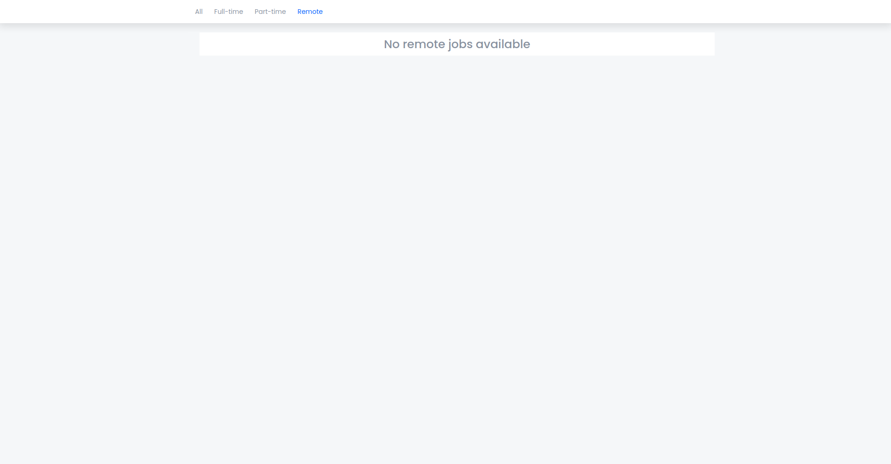

# Briefing

This __responsive__ card model uses __highly browser compatible CSS and HTML__, besides some __Javascript__ for filtering the cards accordingly to the menu options when they are selected. The way the cards are filtered _is not optimized_, but for this case it fits the project well.

The Design was given to me through a __Figma__ file and I followed it precisely.

# Screenshots
### All jobs page

### Full-time page
In this page, one of the cards gets filtered for not being a Full-time job.

### Part-time page
In this page, almost all the cards get filtered, except one.

### Remote page
Because there are no Remote jobs, an error message is displayed.

### Hovered
When the cards are hovered, this is their state(there is a little fading animation).

